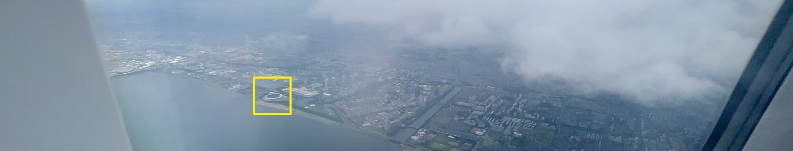

## 4. 旅行照片 3.0

### 尝试与解决

> 关键词：关键词搜索、Google 地图、学术旅行、爆破、街景图、图片搜索
>
> 本题的尝试中，网页搜索全部使用 Google。

这次的旅行照片非常有意思，是一份完整的旅行日记，三个 flag 的题目形式各不相同，却又有所关联。不妨大致看看题目整理一下思路。第一个题目显然是很简单的，看看图片 EXIF 就好了... 吗？


这次图片甚至全都没有 EXIF 信息！

但是，日期信息是非常关键的，要找的后面的活动、海报以及集合地点，显然都需要有日期作为筛选依据。仔细观察图片细节，并没有发现任何可以可靠确定日期的信息，除了……

除了封面图上的飞机照片。飞机照片可以提供两个信息：一个是飞机所在地点，根据窗外的城市景观可以得知；还有一个是机翼上的航司图标。或许这些可以确定航班班次。

可是，你觉得我会去找航班吗？No！日期的数量是十分有限的。一旦确定问题 2 的答案，就可以通过合理自动化尝试获得日期。不过，知道这是什么地方还是有必要的，不然接下来要找的博物馆、广场、出站口等地点都是空谈。

#### 这是什么地方？

首先，根据题目的描述不难判断这里是日本。我们可以沿日本海岸线寻找与图片符合的城市景观，但是这样既耗时又容易遗漏。不妨从照片中找一些更加明确的特征。



这里有个较大的~~核弹发射井~~圆形建筑。[上次的旅行照片](https://github.com/USTC-Hackergame/hackergame2022-writeups/blob/master/official/%E6%97%85%E8%A1%8C%E7%85%A7%E7%89%87%202.0/README.md)也有一个圆形建筑，叫做 ZOZO 海洋球场。要不搜索一下试试看。


*提示：在 Google 地图的图层选项中选择“地球视图”，然后开启卫星地图，可以看到 Google 地球的 3D 模型*

确实！看来这次故事的地点是东京。

#### 神秘奖牌


奖牌的图片上有一个非常明显的线索，是获奖者姓名 `M. KOSHIBA`。以此为关键词上网搜索，可以搜到[这个人的生平信息](https://en.wikipedia.org/wiki/Masatoshi_Koshiba)，知道其就读过 University of Tokyo。其中一项被专门拿出来说的就是 Franklin Institue Award。然而，这样的奖项肯定不会出现在日本学校的展厅中。由于知道奖牌名后还需要继续搜索才能回答问题，我们不能浪费时间对所有奖项逐个尝试（毕竟这样可能也无法真正确定答案）。我们还需要更多信息。

仔细观察，奖牌周围还有一段不那么明显的神秘咒语——INVENTAS VITAM IUVAT EXCOLUISSE PER ARTES。直接上网搜索这段文本，可以找到[诺贝尔文学奖的介绍页面](https://www.nobelprize.org/prizes/facts/the-nobel-medal-for-literature/)。这句神秘咒语的意思是 It is beneficial to have improved (human) life through discovered arts。

但是，诺贝尔文学奖奖章的图案和这张图并不一样。继续查找，可以找到[诺贝尔物理学与化学奖的页面](https://www.nobelprize.org/prizes/facts/the-nobel-medal-for-physics-and-chemistry/)，这里就能找到正确的奖章了。

接下来，考虑到问题问的是学校展厅内的奖章，我们搜索“Tokyo University Nobel Prize”，可以找到一个理学部的标题为 [Nobel Prize](https://www.s.u-tokyo.ac.jp/en/gallery/nobelprize/) 的页面，其中最前面的小标题是 The Nobel Prize Exhibits，看起来大概率就是展厅内展出的东西。三位获奖者中，出生最晚的是 Takaaki Kajita (1959)。点击条目后面“了解更多”的链接，会跳转到域名为 `www.icrr.u-tokyo.ac.jp` 的页面。结合页面标题行上的图标，可以非常确切地知道研究所叫 `ICRR`。

#### 日期呢？

既然已经知道问题 2 的答案，日期就可以合理自动化尝试了。我们首先看一下答案是如何提交的。


这次的加载方式不是直接 Base64 编码请求 `txt` 文件了，不过大同小异，是 POST 文件名到后端。我们将看到的 Base64 文件名解码。

```js
atob('QW5zd2VyMT0yMDIyLTAxLTAxJkFuc3dlcjI9SUNSUg==')
```

```plain
Answer1=2022-01-01&Answer2=ICRR
```

这样，就不难通过浏览器脚本实施自动化了。

```js
// ==UserScript==
// @name        HackerGame 2023 旅行照片 3.0
// @namespace   Violentmonkey Scripts
// @match       http://202.38.93.111:12345/*
// @grant       none
// @version     1.0
// @author      -
// @description 2023/11/1 22:44:48
// ==/UserScript==

;(() => {
  window.sendAnswer = (ans) => new Promise((resolve, reject) => {
    $.ajax({
      url: 'http://202.38.93.111:12345/',
      type: 'POST',
      dataType: 'text',
      data: btoa(ans) + '.txt',
      success: (data) => {
        resolve({success: true, data: data})
      },
      error: (_err) => {
        if(_err.status != 404) {
          reject("Unexpected response");
        }
        resolve({success: false, data: _err})
      }
    })
  })
  window.delay = (ms) => new Promise((resolve) => {
    setTimeout(() => resolve(), ms)
  })

  function buildBoomingData() {
    const ret = []
    for(let i = 2022; i <= 2023; i++) { // 别问，问就是没看到“暑假”两个字
      for(let j = 1; j <= 12; j++) {
        for(let k = 1; k <= 31; k++) {
          let I = '' + i
          let J = (j < 10 ? '0' : '') + j
          let K = (k < 10 ? '0' : '') + k
          ret.push(`Answer1=${I}-${J}-${K}&Answer2=ICRR`)
        }
      }
    }
    return ret
  }

  ;(async () => {
    const boomList = buildBoomingData()

    for(let i = 0; i < boomList.length; i++) {
      const entry = boomList[i]
      console.log(i, entry)
      const result = await sendAnswer(entry)
      if(result.success) {
        console.warn('Found answer', entry, result)
        break
      }
    }
  })()
})()
```

不需要太多时间就能尝试到正确答案，


```plain
Answer1=2023-08-10&Answer2=ICRR
```

日期是 2023-08-10。

#### 这是什么面馆？


要确定中午的活动和博物馆票价，很可能必须知道喷泉公园和博物馆的具体名称。这一对面对面的公园和博物馆是饭后散步的目的地，因此不会离面馆太远。面馆的位置将是一个非常重要的线索。

注意到照片中的“一信”疑似是面馆的名称。在地图中搜索“一信”，即可定位到面馆。地图提供的现场照片也是与这里的旅行照片一致的。


#### 这是什么博物馆/公园？

接下来的工作就是寻找这一对面对面的博物馆和公园。首先搜索“博物馆”，会发现附近有不少博物馆。利用公园现场的照片可以筛选博物馆。在此之前，我们要从照片中提取有效的特征来高效判断公园是否正确。


这样，我们就可以在地图上逐个查看博物馆并检查对面的公园特征。不需要太多时间就可以找到东京国立博物馆以及其对面的公园，特征完全吻合。


查看街景地图，（几乎）满昏匹配！


搜索“Tokyo National Museum”，找到[官网的票价信息](https://www.tnm.jp/modules/r_free_page/index.php?id=113#ticket)，可以知道票价是 1000、500 或 0 日元。由于不明确学长的具体身份和年龄，三种价格都有可能。

#### 这是什么活动？

在博物馆对面举行的活动可能和博物馆有关，但是[博物馆网站的日历上](https://www.tnm.jp/modules/r_calender/index.php?date=2023-08-10)查不到什么有效的信息，说明活动可能并不是博物馆的。

不妨上网搜索上野公园当天的活动，“Ueno park event Aug 10 2023”，可以找到[关于 National Plum Wine Festival 的信息](https://www.google.com/url?sa=t&rct=j&q=&esrc=s&source=web&cd=&ved=2ahUKEwi73oXplaiCAxUsv4kEHf3ZD3QQFnoECA4QAQ&url=https%3A%2F%2Fjapan.stripes.com%2Ftravel%2Fnational-plum-wine-festival-tokyos-ueno-park-aug-10-13&usg=AOvVaw1w04hB1r06zrZ01eIxsaBr&opi=89978449)，且日期是完全匹配的，大概就是了。继续搜索“National Plum Wine Festival 2023”，找到[更详细的介绍页面](https://home.ueno.kokosil.net/en/archives/77158)，其文末有一段关于招募志愿者的公告：

> 【志愿者招募】  
> 我们正在寻找420人！（人数到齐后结束。*先到先得）
>
> https://umeshu-matsuri.jp/tokyo_staff/

点进去之后可以找到问卷链接：https://ws.formzu.net/dist/S495584522/

问卷编号即为 `S495584522`。

*中文搜索也是可以找到的：上野公园 活动 8月10日 2023*

结合两个答案提交验证，并尝试三种可能的博物馆票价，即可得到答案：

```plain
Answer3=S495584522&Answer4=0
```

票价是 0 元。

#### 马里奥世界在哪里？

问题 6 中涉及到了马里奥世界附近的出站口，因此需要先根据照片找出“马里奥世界”的位置。然而，直接搜索马里奥世界，得到的资讯所提供的地点都是 Super Nintendo World。


这个地点在京都市，距离中午的饭馆有数百公里，显然不是晚上一个小时能去的。看来得从照片中提取别的信息。


右边有一个 Nintendo Tokyo 字样，直接在地图上搜索就可以找到相应地点。然而，地图提供的照片里并不能找到这一场景。不敢确定？有办法可以提前确认：用 Google 地图观察建筑的 3D 模型，可以隐约看到侧面有一个类似的楼梯间和一个疑似 Nintendo Tokyo 的红色广告牌。


这就基本确认了。至于 3D 模型为什么没有照片所示的装饰，可能是因为模型太粗糙，也可能因为建模时间太早，当时还没有这个装饰。

*注：通过 Google 图片搜索引擎也可以找到包含类似图片的网页，从而确认地点。*

同时，可以通过地图确认出站口的位置，因为这个地点附近唯一比较近的 JR 站点就是涩谷站。


#### 什么屋顶广告牌？

要前往 Nintendo Tokyo 商店，出站后自然是向北走。


将街景地图定位在出站口，并向北游荡，可以看到路口处有多个高楼和屋顶广告牌，但并不知道是哪个广告牌。但是，与许多国内地图不同，Google 地图的街景照片是非常密集的。在路口四处游荡，就可以看到许多不同的照片。其中，西北角的大楼顶部的广告牌多次出现一可疑动物：


并且是从钟表盘里钻出来的，很符合“每小时出现”的描述。但是，我并不知道这是什么品种——这对于我这种博物学白痴太困难了。但是，我们可以将这个动物截下来交给 Google 图像搜索。


再搜索“涩谷 秋田犬”，方可确认答案。[澀谷站前巨大3D秋田犬現身！整點登場向路人報時，東京街頭的療癒風景](https://www.wowlavie.com/article/ae2201217)

#### 什么神秘售卖活动？

题目文本指出，上野站在当时举行了“ボタン＆カフリンクス”售卖活动。尝试搜索“上野站 ボタン＆カフリンクス”。这个标题的含义是“纽扣和袖扣”，看起来没什么头绪。不妨随便搜索一下“上野 ボタン＆カフリンクス”。

果不其然，网页结果里并没有什么相关的信息。


但是，这题要的是海报上的信息，可以试试图片搜索。


这里找到了题目所说的粉红色海报。继续探索图片来源，发现其确实是可靠的。动物是熊猫。

*注：这题如果搜索“上野站 ボタン＆カフリンクス”是会失败的。这是因为“上野站”是中文而后面是日语，两者很难出现在同一篇内容中，错失了关联搜索的机会。而“上野”既是中文也是日语，因为“上野站”在日语中叫“上野駅”。*

#### 集合地点？

如果直接只搜索“Tokyo rainbow bridge night cruise”或者“Tokyo rainbow bridge night tour”，则只能找到一些[公开的旅游路线信息](https://tokyocheapo.com/entertainment/music-and-nightlife/low-cost-night-cruises-tokyo-bay/)，集合地点[五花](https://www.gotokyo.org/shuun/en/course/011.html)[八门](https://www.gotokyo.org/shuun/en/course/010.html)，且多数不是四个字。即使加上“August 2023”也无济于事。这看起来毫无头绪。

然而，仔细阅读文字，会发现反常的关键词：学长那天晚上将继续他的**学术之旅**。学术之旅，怎么会是乘船巡游观景呢？看来，这只能是某次学术集会（或夏令营）的旅游项目了。这样，就可以拟定出搜索关键词“Tokyo academic congress tour August”。这里关键词不用“August 10”，这是因为学术会议网站往往只会写日期范围，其中可能不包括“August 10”，但是几乎一定包含“August”。

找到的第一个符合日期范围的会议是 [WTC 2023](https://www.wtc2022tokyo.org/)，其中 8 月 10 日包含一次 [Tokyo night tour](https://www.wtc2022tokyo.org/complimentary_tours.html)。然而，这里的 night tour 没有说是乘船，显得很可疑。文本提示集合地点在会址 [Keio Plaza Hotel Tokyo](https://www.keioplaza.com/index.html?_ga=2.67562449.1380023500.1690362918-714672166.1689295036)，这附近并没有突出的地标建筑，反复尝试提交周围建筑名称作为答案也没有成功。看来可能不是这个会议。

继续翻看几个网站都不符合要求。

但是，WTC 2023 网站给了我们一个词——complimentary。这样，我们可以尝试修改关键词为“Tokyo academic congress complimentary August”。这次我们找到了 [STATPHYS28](https://statphys28.org/) 的网站，其中包含了 8 月 10 日星期四的 [Tokyo Night View Tours](https://statphys28.org/socialprogram.html)，然而这是 Bus Tour。

且留下！这个网站的 [Banquet 页面](https://statphys28.org/banquet.html)也包含了一些旅行信息，包括 8 月 10 日的 STATPHYS28 Banquet on “Yakatabune” Boat。这次，描述与题目完美吻合：

> The banquet will provide attendees the opportunity to savor the night view of Tokyo while indulging in a traditional Japanese meal.

描述中还特别说明了 Meeting Point：

> 6:00pm, August 10th (Thursday) all the participants must gather on time South side of Yasuda Auditorium (see the map below)

搜索 Yasuda Auditorium，得到其中文名称“安田讲堂”，看来大概率是对的了。

```plain
Answer5=安田讲堂&Answer6=熊猫-秋田犬
```

通过！

### Flags

```plain
flag{how_I_wi5h_i_COulD_w1N_A_Nobe1_pri23_ee7167b17a}
```

How I wish I could win a nobel prize!

```plain
flag{PluM_w1NE_1S_rEa1LY_EXpen5iVE_b0047f3215}
```

Plum wine is really expensive.

```plain
flag{Un7I1_W3_M337_A64iN_6oODByE_S3n1OR_5f91d0eaae}
```

Until we meet again. Goodbye, senior!

### 不可行的做法

#### 遍历日本海岸线

事实证明飞机上看到的海岸线在一个海湾内，遍历日本海岸线非常耗时，而且极其容易遗漏这个地方。

#### 问题 5：将东京都试一遍

事实证明，答案“安田讲堂”虽然是一定范围内的“标志性建筑”，但却不是东京的地标。将东京都试一遍也是大概率试不出来的。

... 除非你有办法导出地图中的所有地点标记并且准确无误地翻译成中文，然后自动化尝试一下或许可以。

但是至少两个人确实试了，我不说是谁...


